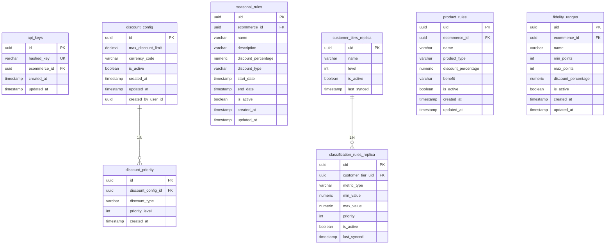

# Diagrama de Base de Datos - Service Admin

```mermaid
erDiagram
    %% SERVICE-ADMIN - Tablas Principales
    
    ecommerce ||--o{ api_keys : "1:N"
    ecommerce ||--o{ users : "1:N"
    ecommerce ||--o{ seasonal_rules : "1:N"
    ecommerce ||--o{ product_rules : "1:N"
    ecommerce ||--o{ fidelity_ranges : "1:N"
    ecommerce ||--o{ discount_config : "1:1"
    ecommerce ||--o{ discount_configurations : "1:1"
    
    users ||--o{ audit_logs : "1:N"
    
    customer_tiers ||--o{ classification_rules : "1:N"
    
    discount_config ||--o{ discount_limit_priority : "1:N"
    discount_configurations ||--o{ discount_priorities : "1:N"
    
    permissions ||--o{ role_permissions : "1:N"
    
    ecommerce {
        uuid uid PK
        varchar name
        varchar slug UK
        varchar status
        timestamp created_at
        timestamp updated_at
    }
    
    api_keys {
        uuid id PK
        varchar hashed_key UK
        uuid ecommerce_id FK
        timestamp created_at
        timestamp updated_at
    }
    
    users {
        bigint id PK
        varchar username UK
        varchar password
        varchar role
        boolean active
        uuid ecommerce_id FK
        uuid uid UK
        timestamp created_at
        timestamp updated_at
    }
    
    permissions {
        bigint id PK
        varchar code UK
        varchar description
        varchar module
        varchar action
        timestamp created_at
    }
    
    role_permissions {
        bigint id PK
        string role
        bigint permission_id FK
        timestamp created_at
    }
    
    audit_logs {
        bigint id PK
        uuid user_uid FK
        varchar action
        varchar description
        uuid actor_uid FK
        timestamp created_at
    }
    
    discount_configurations {
        uuid id PK
        uuid ecommerce_id FK UK
        varchar currency
        varchar rounding_rule
        varchar cap_type
        numeric cap_value
        varchar cap_applies_to
        bigint version
        timestamp created_at
        timestamp updated_at
    }
    
    discount_priorities {
        uuid id PK
        uuid configuration_id FK
        varchar discount_type
        int priority_order
    }
    
    seasonal_rules {
        uuid uid PK
        uuid ecommerce_id FK
        varchar name
        varchar description
        numeric discount_percentage
        varchar discount_type
        timestamp start_date
        timestamp end_date
        boolean is_active
        timestamp created_at
        timestamp updated_at
    }
    
    customer_tiers {
        uuid uid PK
        varchar name UK
        int level
        boolean is_active
        timestamp created_at
        timestamp updated_at
    }
    
    product_rules {
        uuid uid PK
        uuid ecommerce_id FK
        varchar name
        varchar product_type
        numeric discount_percentage
        varchar benefit
        boolean is_active
        timestamp created_at
        timestamp updated_at
    }
    
    classification_rules {
        uuid uid PK
        uuid customer_tier_uid FK
        varchar metric_type
        numeric min_value
        numeric max_value
        int priority
        boolean is_active
        timestamp created_at
        timestamp updated_at
    }
    
    fidelity_ranges {
        uuid uid PK
        uuid ecommerce_id FK
        varchar name
        int min_points
        int max_points
        numeric discount_percentage
        boolean is_active
        timestamp created_at
        timestamp updated_at
    }
    
    discount_config {
        uuid uid PK
        uuid ecommerce_id FK
        decimal max_discount_limit
        varchar currency_code
        boolean is_active
        timestamp created_at
        timestamp updated_at
    }
    
    discount_limit_priority {
        uuid uid PK
        uuid discount_config_id FK
        varchar discount_type
        int priority_level
        timestamp created_at
    }
```

---

# Diagrama de Base de Datos - Service Engine



---

# INCONSISTENCIAS DETECTADAS

## 1. **Tablas duplicadas para configuración de descuentos**

| Service Admin | Service Engine | Problema |
|---------------|----------------|----------|
| `discount_configurations` + `discount_priorities` | `discount_config` + `discount_priority` | Estructuras diferentes |
| V11 (discount_configurations) | V3 (discount_config) | Funcionalidad similar pero no identical |

**Detalle:**
- **Admin**: `discount_configurations` tiene `ecommerce_id` (multi-tenant), `version` para optimistic locking
- **Engine**: `discount_config` NO tiene `ecommerce_id` (global, una sola config activa)

## 2. **Tabla `discount_config` duplicada**

- **Service Admin** (V19): `discount_config` con `ecommerce_id`, `max_discount_limit`, `currency_code`
- **Service Engine** (V3): `discount_config` con `max_discount_limit`, `currency_code`, `created_by_user_id`

Ambas representan lo mismo pero con campos diferentes.

## 3. **Seasonal rules sin FK en Engine**

- **Admin**: `seasonal_rules` tiene FK a `ecommerces(uid)`
- **Engine**: `seasonal_rules` NO tiene FK (replica, datos no persistentes)

## 4. **Customer tiers split entre tablas**

- **Admin**: `customer_tiers` (maestro global)
- **Engine**: `customer_tiers_replica` (réplica local)

## 5. **Nombres inconsistentes**

| Concepto | Admin | Engine |
|----------|-------|--------|
| Clasificación clientes | `customer_tiers` + `classification_rules` | `customer_tiers_replica` + `classification_rules_replica` |
| Rangos fidelidad | `fidelity_ranges` | `fidelity_ranges` (igual) |
| Reglas producto | `product_rules` | `product_rules` (igual pero sin FK) |

## 6. **Falta de sincronización clara**

- No hay mapeo claro de qué tablas se replican de Admin a Engine
- Las réplicas tienen nombres diferentes (algunas con `_replica`, otras sin él)
- Algunas réplicas tienen FK (`classification_rules_replica` → `customer_tiers_replica`), otras no (`fidelity_ranges` sin FK a `ecommerces`)