# Diagrama ER - Service Admin (Corregido)

```mermaid
erDiagram
    ecommerce ||--o{ user : "belongs_to"
    ecommerce ||--o{ api_key : "owns"
    ecommerce ||--o{ seasonal_rule : "defines"
    ecommerce ||--o{ product_rule : "defines"
    ecommerce ||--o{ fidelity_range : "defines"
    ecommerce ||--o{ discount_setting : "configures"
    ecommerce ||--o{ discount_application_log : "records"
    ecommerce ||--o{ discount_usage_history : "monitors_performance"

    user ||--o{ audit_log : "generates"
    user ||--o{ discount_usage_history : "consults"
    role ||--o{ user : "assigned_to"
    role ||--o{ role_permission : "has"
    permission ||--o{ role_permission : "grants"

    discount_setting ||--o{ discount_priority : "orders"
    customer_tier ||--o{ classification_rule : "governed_by"

    ecommerce {
        uuid id PK
        varchar name
        varchar slug UK
        varchar status "ACTIVE, INACTIVE"
        timestamp created_at
    }

    user {
        uuid id PK
        uuid ecommerce_id FK
        uuid role_id FK
        varchar username UK
        varchar password_hash
        boolean is_active
        timestamp last_login
    }

    role {
        uuid id PK
        varchar name UK "SUPER_ADMIN, STORE_ADMIN, STORE_USER"
    }

    permission {
        uuid id PK
        varchar code UK
        varchar module
        varchar action "read, write, delete"
    }

    role_permission {
        uuid id PK
        uuid role_id FK
        uuid permission_id FK
    }

    api_key {
        uuid id PK
        uuid ecommerce_id FK
        varchar key_prefix
        varchar hashed_key UK
        timestamp expires_at
        boolean is_active
    }

    discount_setting {
        uuid id PK
        uuid ecommerce_id FK
        decimal max_discount_cap
        varchar currency_code
        varchar rounding_rule
        timestamp updated_at
    }

    discount_priority {
        uuid id PK
        uuid discount_setting_id FK
        varchar discount_type "SEASONAL, PRODUCT, FIDELITY"
        int priority_level
    }

    seasonal_rule {
        uuid id PK
        uuid ecommerce_id FK
        varchar name
        numeric discount_percentage
        timestamp start_date
        timestamp end_date
        boolean is_active
    }

    product_rule {
        uuid id PK
        uuid ecommerce_id FK
        varchar name
        varchar product_type
        numeric discount_percentage
        boolean is_active
    }

    fidelity_range {
        uuid id PK
        uuid ecommerce_id FK
        varchar name
        int min_points
        int max_points
        numeric discount_percentage
        boolean is_active
    }

    customer_tier {
        uuid id PK
        varchar name UK
        int level
        boolean is_active
    }

    classification_rule {
        uuid id PK
        uuid customer_tier_id FK
        varchar metric_type "total_spent, order_count"
        numeric min_value
        numeric max_value
        int priority
        boolean is_active
    }

    discount_application_log {
        uuid id PK
        uuid ecommerce_id FK
        varchar external_order_id
        decimal original_amount
        decimal final_amount
        decimal total_discount_applied
        jsonb applied_rules_details
        timestamp created_at
    }

    discount_usage_history {
        uuid id PK
        uuid ecommerce_id FK
        varchar external_order_id "ID del pedido en el cliente"
        decimal subtotal_before
        decimal total_discount
        decimal final_amount
        jsonb applied_rules_snapshot "Copia de las reglas aplicadas en ese momento"
        timestamp processed_at
    }

    audit_log {
        uuid id PK
        uuid user_id FK
        varchar action "CREATE, UPDATE, DELETE"
        varchar target_entity "RULE, CONFIG, USER"
        jsonb change_data "{'old': ..., 'new': ...}"
        timestamp created_at
    }
```

---

## Resumen de Tablas

| Tabla | Descripción |
|-------|-------------|
| `ecommerce` | Tenants (tiendas/clientes) |
| `user` | Usuarios del sistema por ecommerce |
| `role` | Roles: SUPER_ADMIN, STORE_ADMIN, STORE_USER |
| `permission` | Permisos granulares por módulo |
| `role_permission` | Relación rol-permiso |
| `api_key` | API keys para autenticación |
| `discount_setting` | Configuración de descuentos por ecommerce |
| `discount_priority` | Prioridad de tipos de descuento |
| `seasonal_rule` | Reglas de temporada |
| `product_rule` | Reglas por tipo de producto |
| `fidelity_range` | Rangos de fidelidad (puntos) |
| `customer_tier` | Niveles de cliente (Bronze, Silver, Gold, Platinum) |
| `classification_rule` | Reglas de clasificación a cada tier |
| `discount_application_log` | Log de descuentos aplicados |
| `discount_usage_history` | Historial de uso de descuentos (RabbitMQ) |
| `audit_log` | Auditoría de cambios (HU-13.1) |