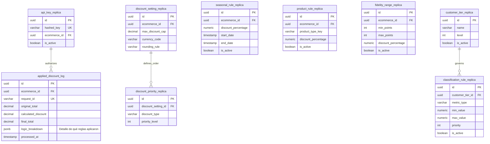

# Diagrama ER - Service Engine

---

## Resumen de Tablas

| Tabla | Tipo | Descripción |
|-------|------|-------------|
| `api_key_replica` | Read | Réplica de API keys (auth) |
| `discount_setting_replica` | Read | Réplica de configuración de descuentos |
| `discount_priority_replica` | Read | Réplica de prioridades de descuento |
| `seasonal_rule_replica` | Read | Réplica de reglas de temporada |
| `product_rule_replica` | Read | Réplica de reglas por producto |
| `fidelity_range_replica` | Read | Réplica de rangos de fidelidad |
| `customer_tier_replica` | Read | Réplica de niveles de cliente |
| `classification_rule_replica` | Read | Réplica de reglas de clasificación |
| `applied_discount_log` | Write | Log de descuentos aplicados (transaccional) |